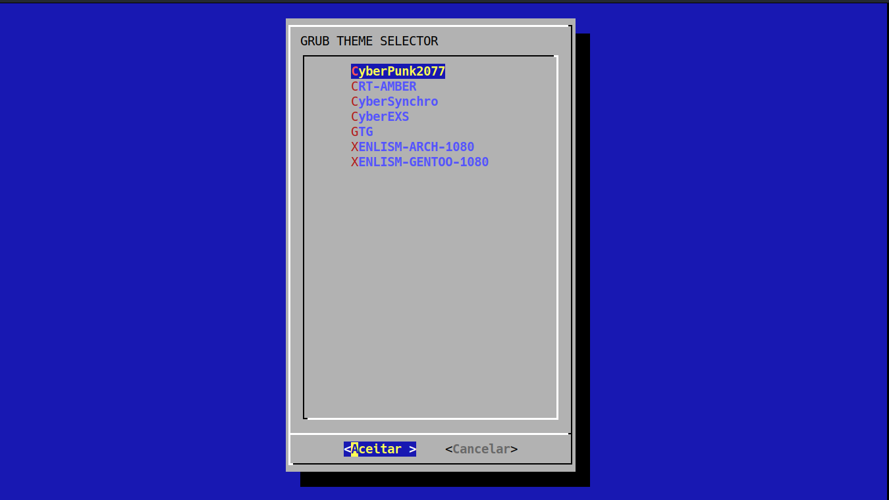
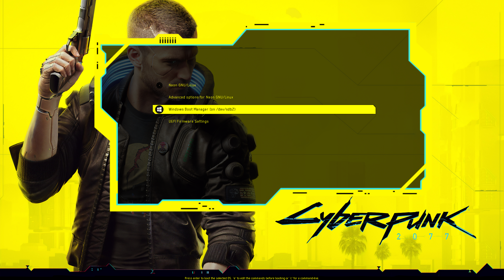
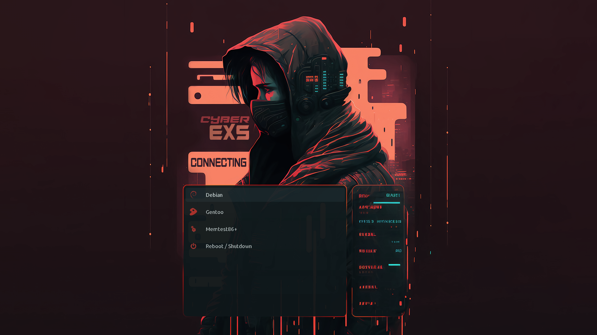
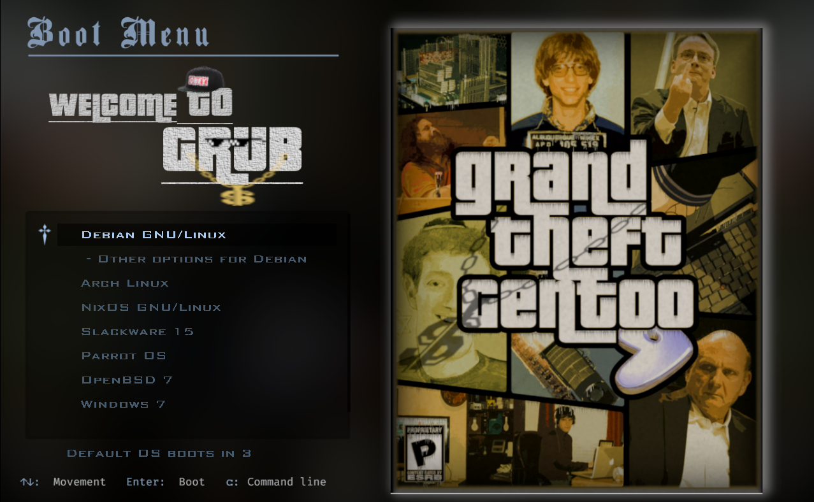
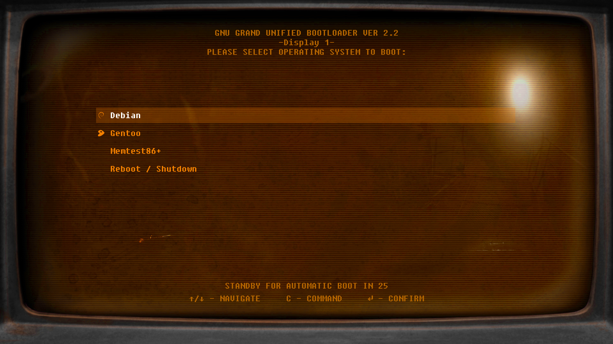

# Menu Theme Selector

```sh
git clone https://github.com/leonidasroberto/grub-themes;cd grub-themes;./install.sh
```
[Created By Leonidas Roberto](https://github.com/leonidasroberto)
##
### CyberPunk2077

[Theme Creator Page](https://www.gnome-look.org/p/1515662)
##
### CyberEXS

[Theme Creator Page](https://www.gnome-look.org/p/1968990)
##
### GTG

[Theme Creator Page](https://www.gnome-look.org/p/2064031)
##
### Xenlism-ubuntu

[Theme Creator Page](https://www.gnome-look.org/p/1440862)
##
### CyberSynchro

[Theme Creator Page](https://www.gnome-look.org/p/1972621)
##
### CRT-Amber

[Theme Creator Page](https://www.gnome-look.org/p/1727268)
